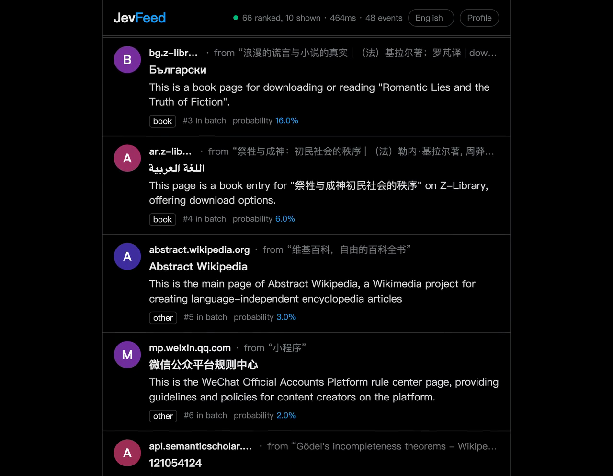

# JevFeed

An infinite feed built from your own browser history, ranked in real time by
[TypeSafe's Jev](https://docs.typesafe.ai/). No likes, no follows, no accounts.
Every link in it is a real page that someone linked to from something you already read.

[](docs/media/demo.mp4)

*Real output: fifty links pulled from pages in one browser history, each summarized and
labelled, ranked by Jev, top ten per batch. [Watch the clip](docs/media/demo.mp4).*

## How it works

1. **Seeds.** JevFeed reads your local Chrome/Arc/Brave/Edge history and takes the last 200 pages you visited.
2. **Candidates.** It fetches each of those pages through [Jina Reader](https://jina.ai/reader) and pulls the links out of the body text, skipping navigation, footers and social chrome.
3. **Summaries.** A cheap text model writes one sentence about each candidate and labels what kind of page it is. Tools, shopping pages and bare link lists are dropped here.
4. **Ranking.** Every unseen candidate goes to Jev in a single request. It returns a probability distribution over all of them, and the top ten become your next batch.
5. **Feedback.** How long you lingered, how fast you scrolled past, what you opened and how long you read it. The last 150 of those go back into the next request, unchanged.

There are no buttons. The feed is the interface.

## Run it

Requires Node.js 22 or newer.

```sh
git clone https://github.com/fengyiqicoder/jevfeed.git
cd jevfeed
cp .env.example .env.local   # add your keys
npm start
```

Open http://127.0.0.1:3050, pick a browser profile, and start scrolling.

| Key | Needed? | What it does |
| --- | --- | --- |
| `TYPESAFE_API_KEY` | yes | Jev ranks the candidates |
| `OPENROUTER_API_KEY` | recommended | summaries and page-kind filtering |
| `JINA_API_KEY` | optional | faster crawling, higher rate limit |

## What leaves your machine

Your history file is read locally and never uploaded. What Jev receives is a
condensed profile: the titles of pages you visited, the titles you opened in the
feed, your recent scroll behaviour, and the candidate list. Candidate pages
themselves are fetched over the network, so their URLs reach Jina and the
summarizer. Everything is stored in `data/jevfeed.sqlite`, which is gitignored.

## Why it is built this way

The obvious version of this product generates the next thing you'll look at and
optimizes for your dwell time. That converges on a mirror of your own habits and
has no source you can check. JevFeed instead chooses among links real people put
in real pages, so the feed can carry you somewhere your history doesn't already
point, and every item has an author and a URL.

## Design notes

- One Jev request per batch of ten, not one per item. Jev's distribution over all candidates *is* the ranking.
- At most 255 choices per request and roughly 60 KB of JSON; the client shrinks the candidate set and retries if it overshoots.
- Dwell is credited only to the post nearest the middle of the screen. Crediting everything on screen gives every visible post the same number, which is not attention.
- Near-identical titles collapse, and one domain can take at most three slots per batch.
- Blocked page kinds stay in the database, so changing the rule needs no re-summarizing.

## Development

```sh
npm test     # 17 tests, no network, no keys needed
```

| Path | What's in it |
| --- | --- |
| `src/history.mjs` | finds and reads browser profiles |
| `src/crawl.mjs` | Jina Reader and raw-HTML link extraction |
| `src/summarize.mjs` | summaries, page kinds, feed language |
| `src/jev.mjs` | the ranking request and its guardrails |
| `src/db.mjs` | SQLite schema, candidate pool, behaviour log |
| `src/server.mjs` | HTTP API and the background pipeline |
| `public/index.html` | the feed |

MIT licensed.
